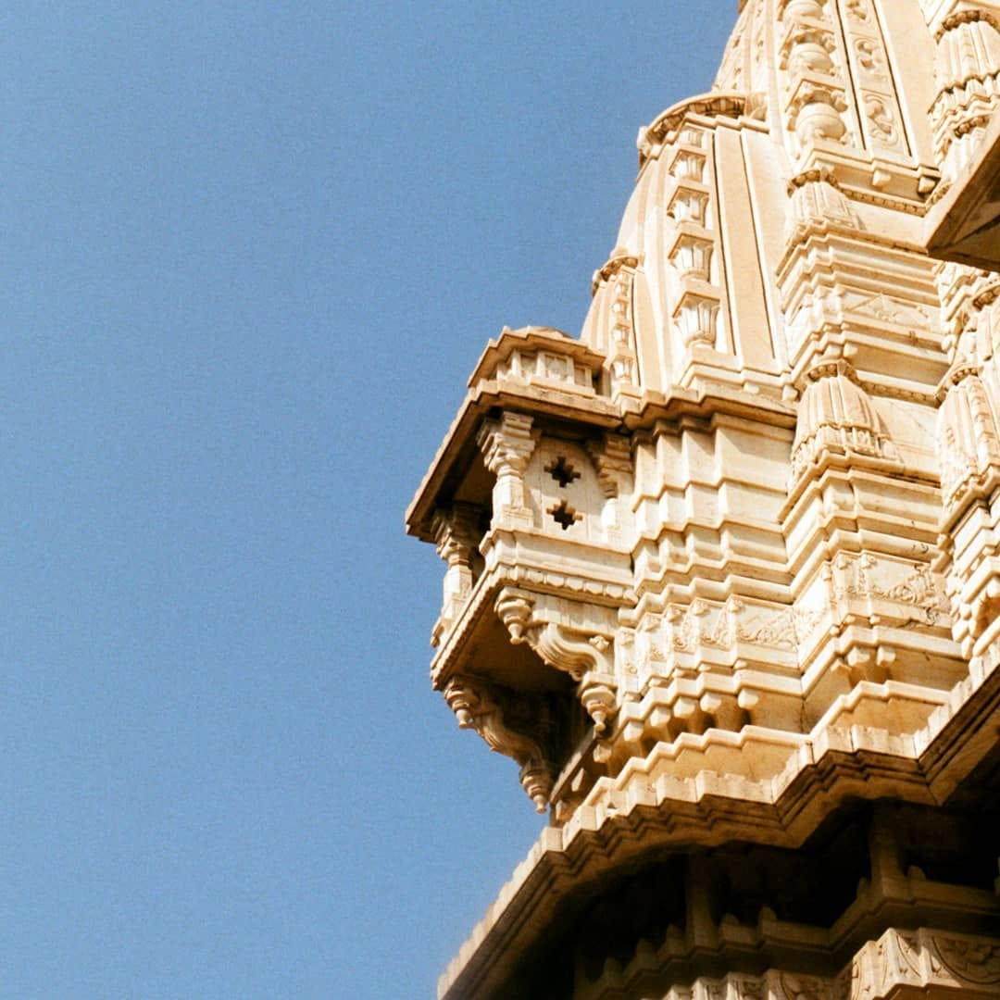
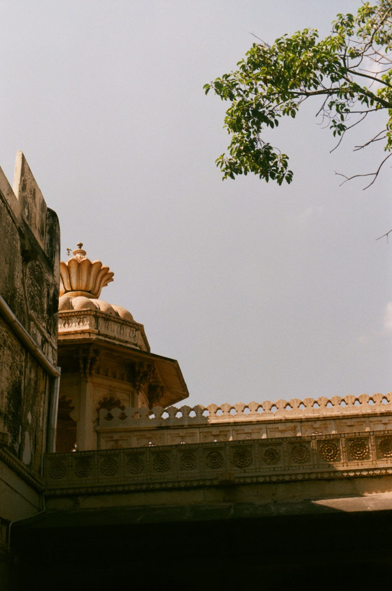
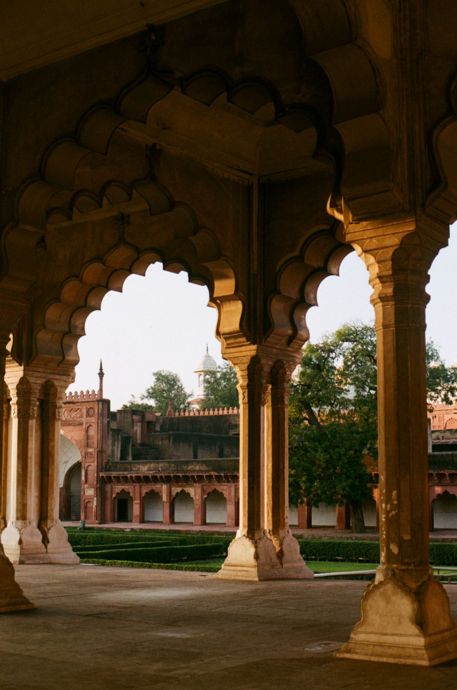
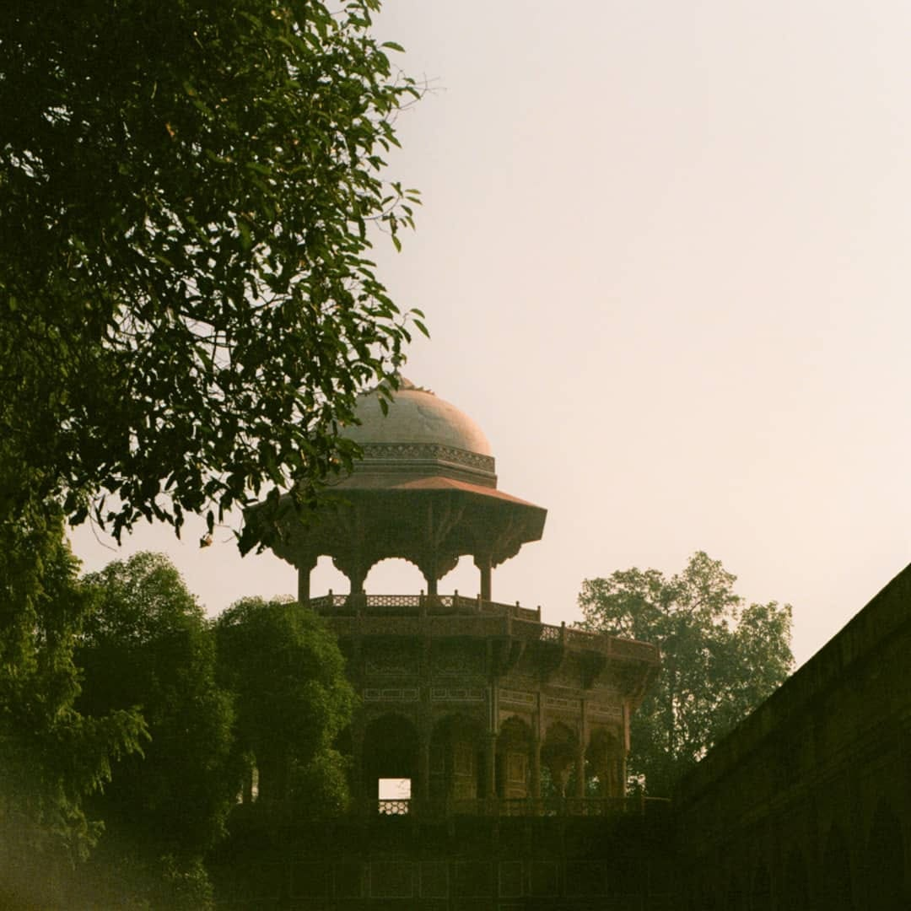
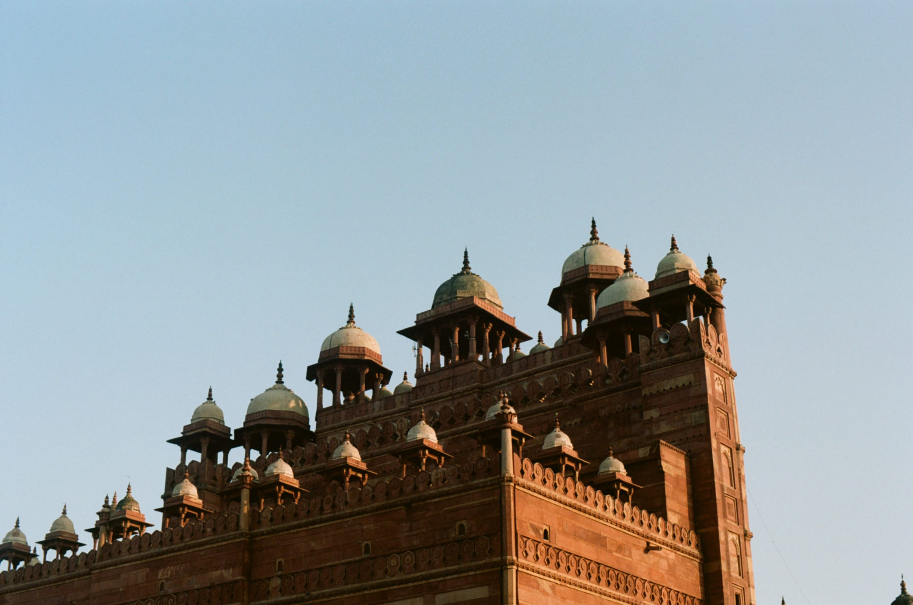
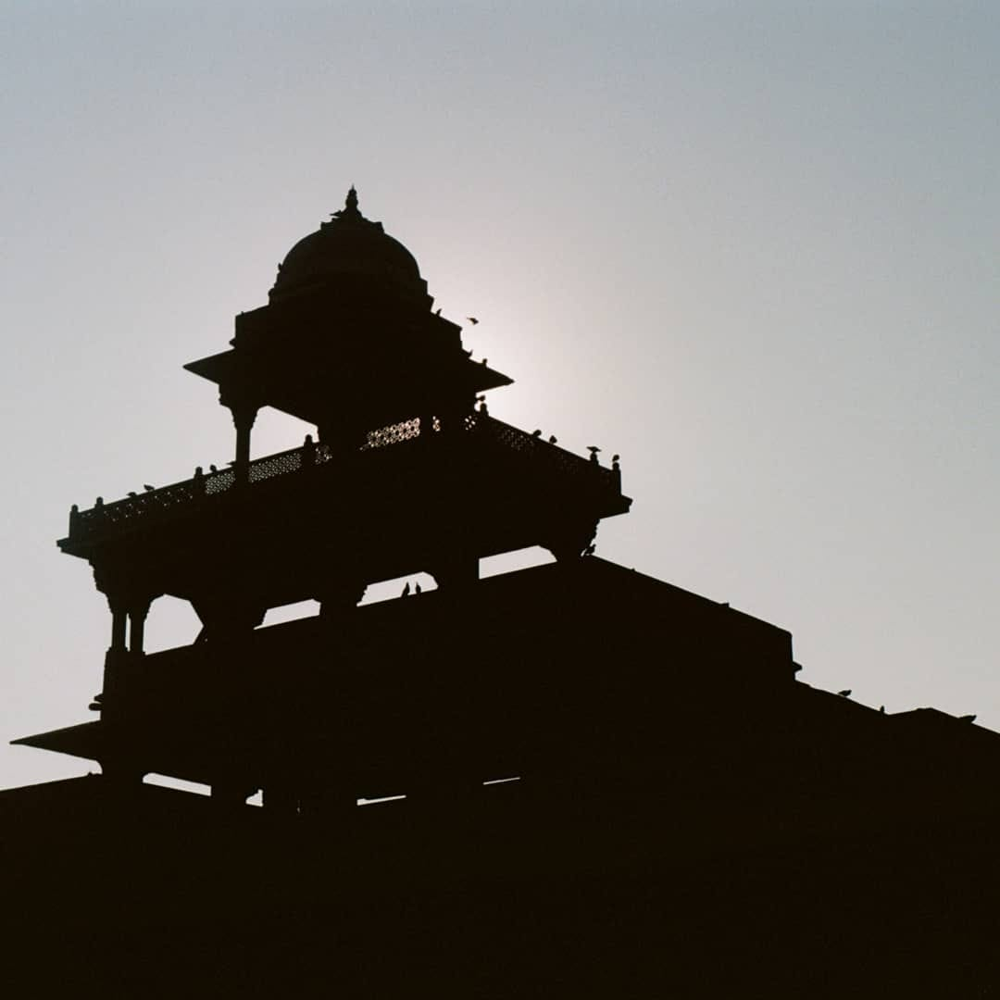
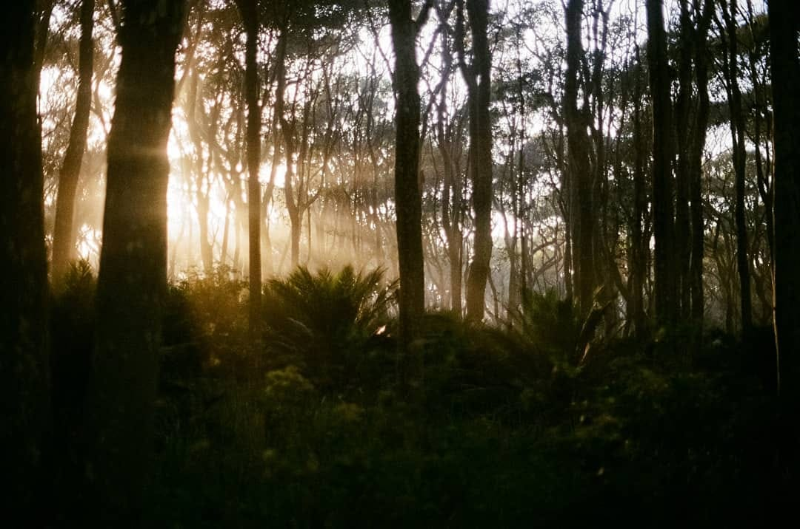
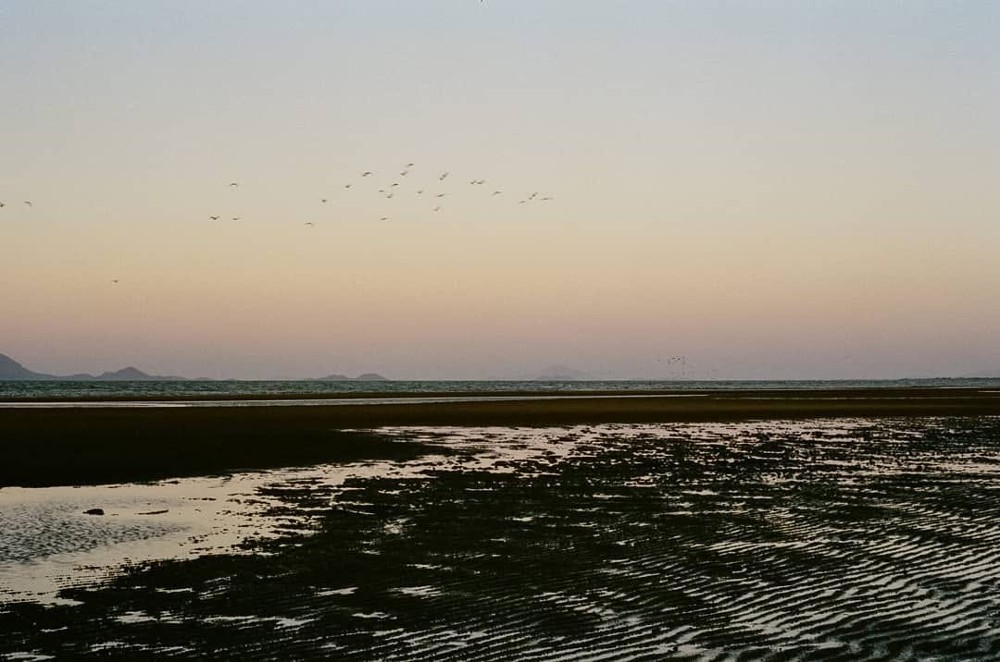
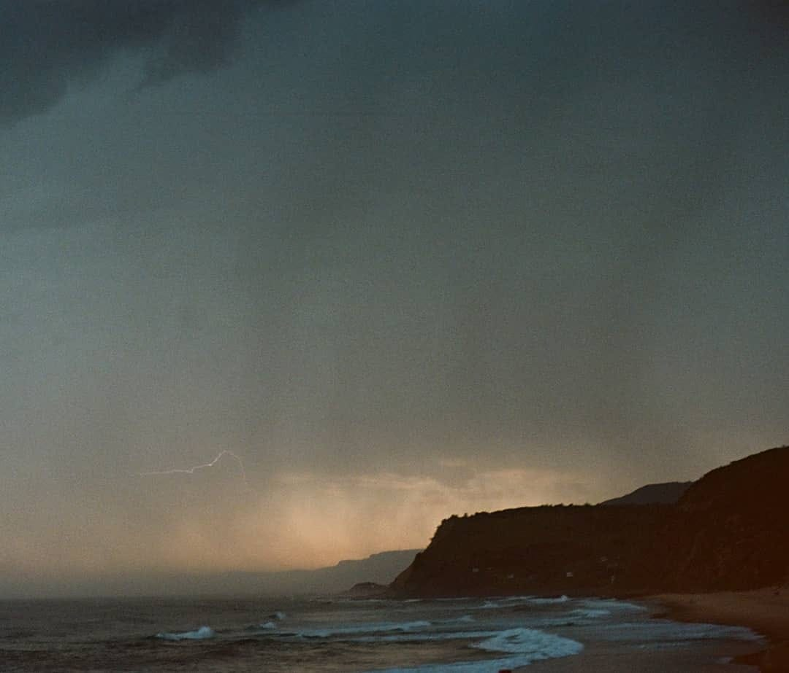
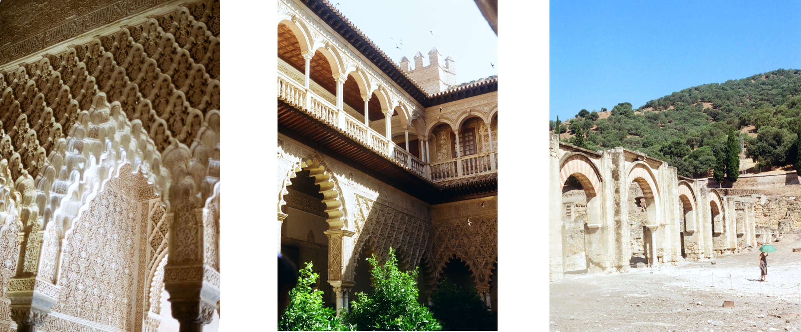

## Photographic Approach

Many of the photos here were captured at architectural monuments in North India during my travels. I shoot with an SLR camera, using a 50mm lens and a red light filter.

When photographing, I avoid the classic magazine shots. Instead, I focus on the fundamentals of framing and lighting, waiting for something to catch my eye - an interesting angle, unique lighting, or an atmospheric haze. The vertical format allows me to capture the soaring heights of architectural elements, drawing the viewer's eye upward just as these structures do in person.

## Personal Connection

My favorite photo, shown below, was taken in a state forest near Batemans Bay. Though I've yet to surpass it, I keep striving to improve. The other images were taken at Red Fort and Fatehpur Sikri, North India. I had studied Fatehpur Sikri as a precedent in my capstone studio at UTS, so visiting it was a profound experience. The red filter on my camera made the granite glow beautifully. All images are unedited, apart from cropping.

Architecture photography captures more than just buildings—it documents human creativity, cultural history, and the relationship between space and light. By mixing portrait and landscape orientations, I aim to provide a more complete viewing experience that emphasizes both the horizontal expansiveness and vertical grandeur of these remarkable structures.
