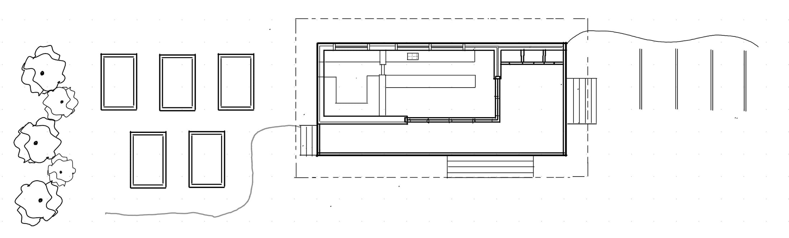
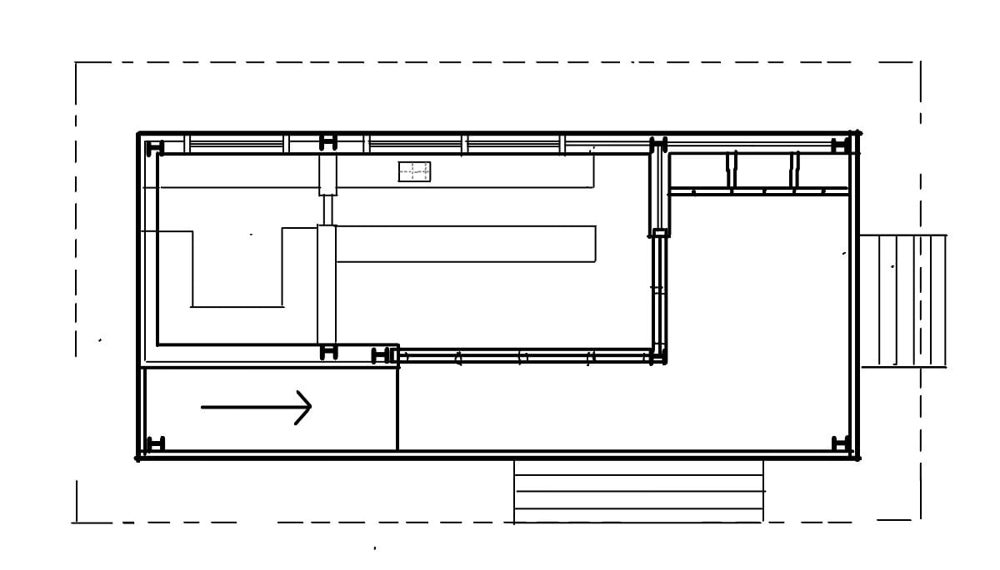
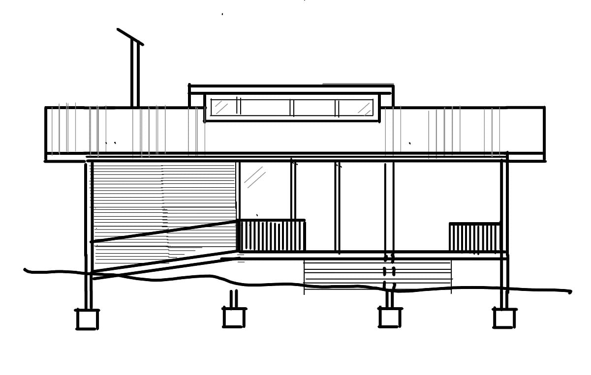
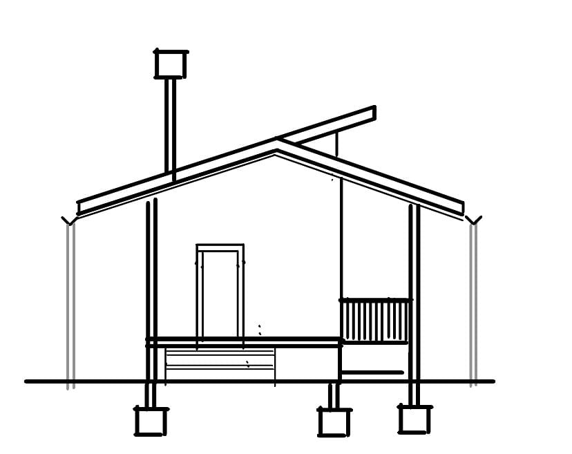
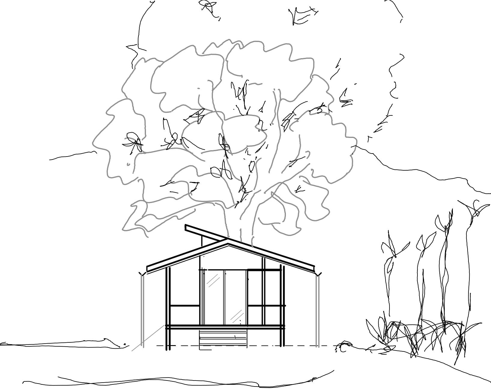

## Project Overview

This project involved creating conceptual sketches for a commercial kitchen facility in a rural setting. The drawings were initially developed as a massing exercise to explore spatial relationships and volumetric form, then refined and cleaned up for client presentation.

## Design Approach

The sketches focus on a straightforward, functional layout that addresses the specific requirements of a commercial kitchen while harmonizing with the rural context. The design prioritizes operational efficiency while maintaining aesthetic appeal appropriate for the setting.

The floor plan illustrates the efficient workflow design, with clear zones for food preparation, cooking, storage, and service. Special attention was paid to circulation patterns, equipment placement, and compliance with commercial kitchen regulations.

## Presentation Strategy

The sketches were deliberately kept clean and straightforward to communicate the essential architectural ideas without unnecessary embellishment. This approach allowed the client to focus on the fundamental aspects of the design - spatial organization, volumetric relationships, and overall form - without being distracted by decorative details that would be developed in later stages.
