## Project Overview

The Condell Park project, as it was known around the office, was an adaptive reuse project for our client ShoreHire, an engineering company specialising in the manufacture and installation of shoring equipment for worksites. The brief was to create an office space using a warehouse that the company had recently purchased to replace their existing offices in the same suburb, as part of larger company changes.

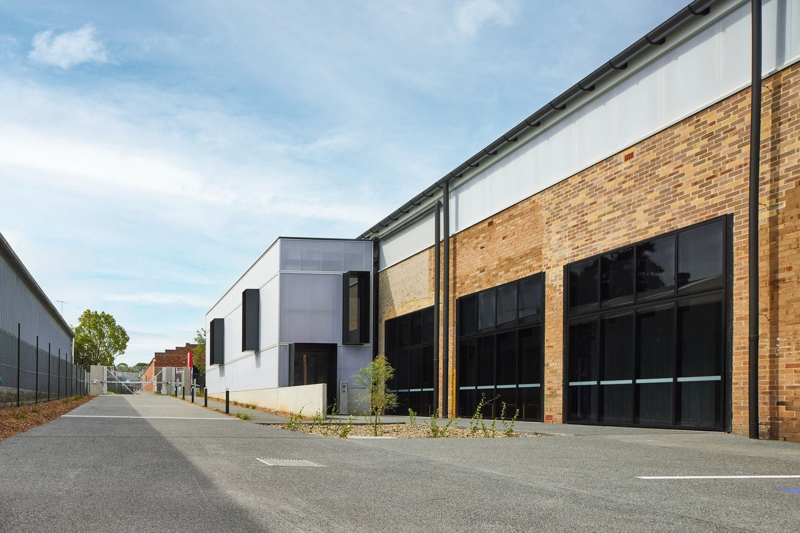

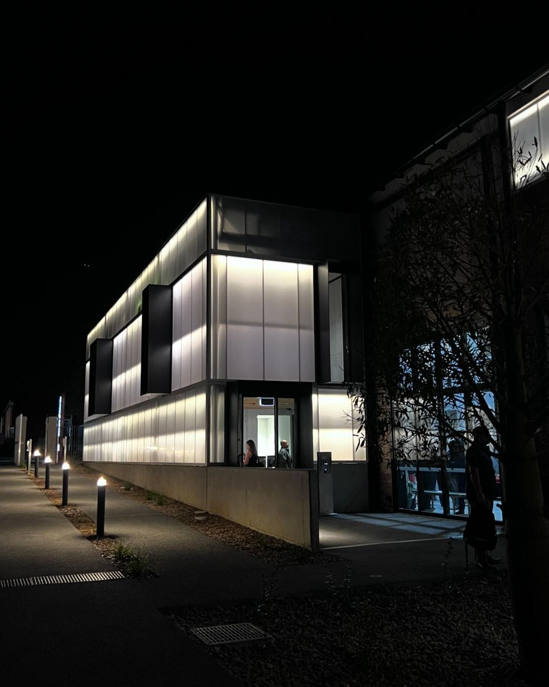

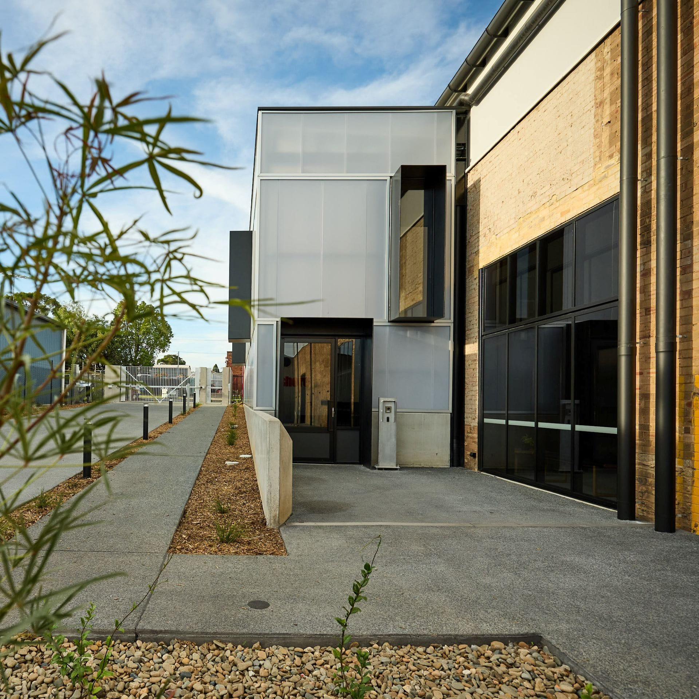

I took on this project right after the concept development stage and carried it through AD to CD, assisting on-site as needed and documenting changes and developments throughout the process. The client favoured a clean industrial look, which was carried through the design process to completion in all aspects.

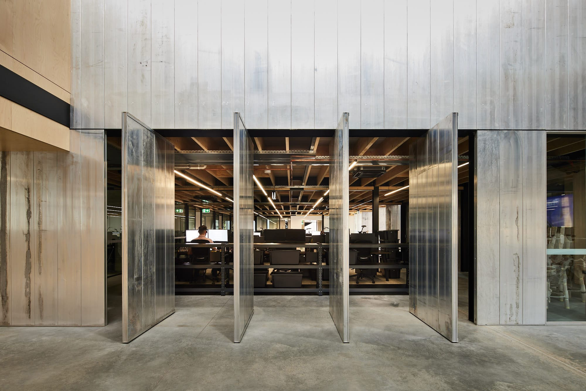

## Distinctive Design Elements

The sweeping matte black spiral staircase is one of two feature staircases. It is set against semi-transparent polycarbonate panelling and feature aluminium block panelling, which is heavily featured in the design. This aluminium panelling is actually a ShoreHire product, originally designed for trenches, reimagined here as an architectural feature.

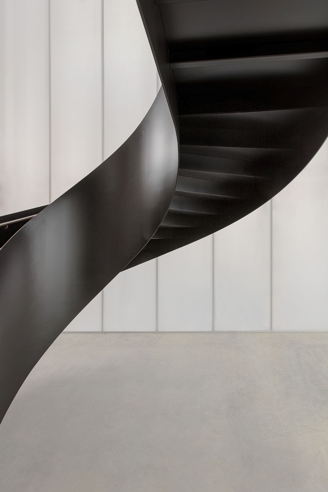

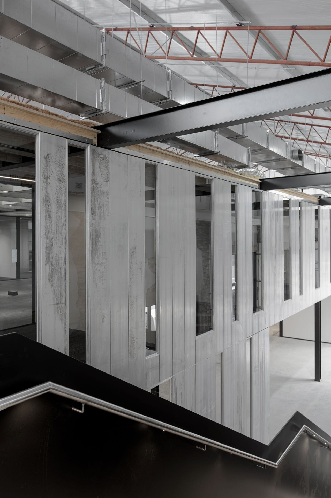

## Innovative Material Use

The polycarbonate panel extension to the building houses the reception area and amenities on the ground level, while on Level 01, large, bright meeting and conference rooms are housed. The documentation shows the Danpalon polycarbonate panels in elevation, configured in a 'brick' tiling pattern. The window boxes featured here and on the front facade of the project are sized to be as wide as the Danpal panels to seamlessly fit into the design. This required some non-standard fixing methods, which were integrated into the design.

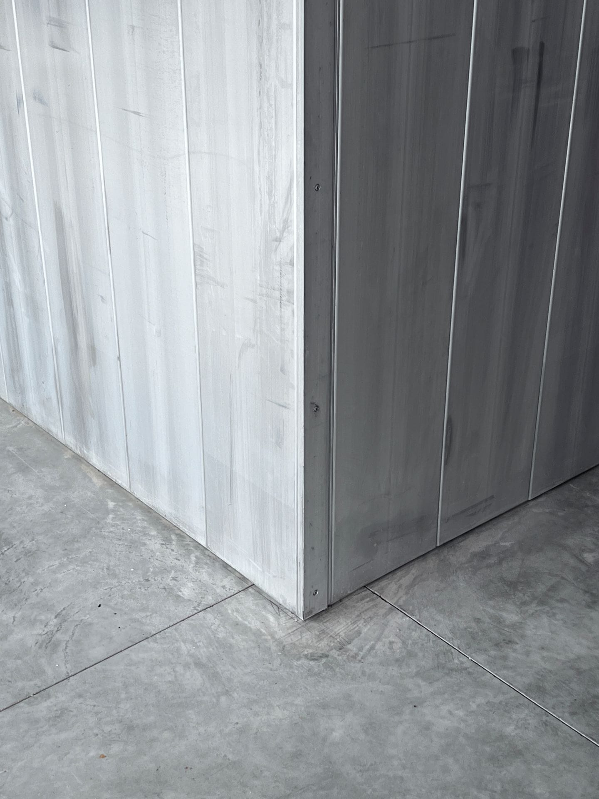

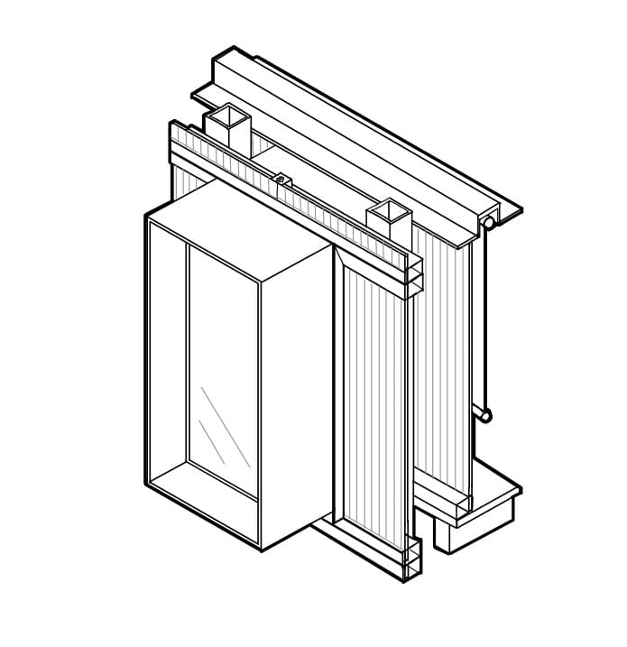

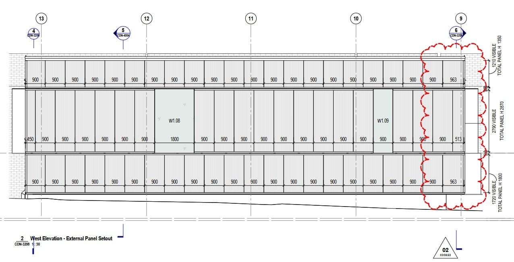

## Workspace Innovation

Possibly the most unique part of the project is inside the warehouse: a large glass and aluminium box housing the main workspace. The proprietary aluminium and channel system were employed in various ways to create a modular walling and glazing system, which was then arrayed to create the office space. The raw milled aluminium finish of these boxes is endlessly interesting, with all of the factory imperfections showing in rainbow colours, which are unfortunately very difficult to capture with a camera. Additionally, the panels were employed in multiple pivot doors, arrayed to create a large, solid, and operable wall.

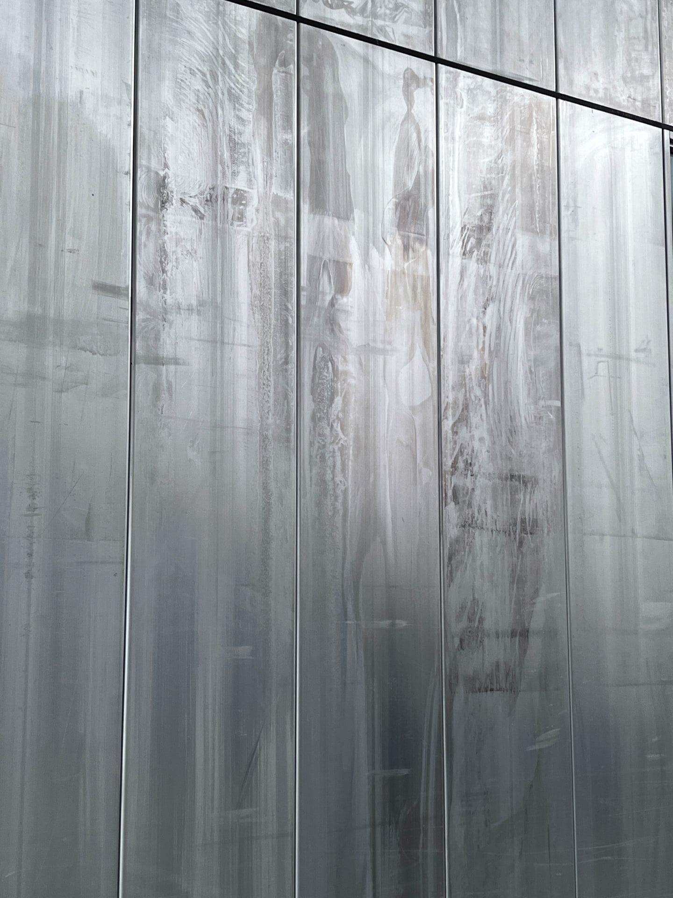

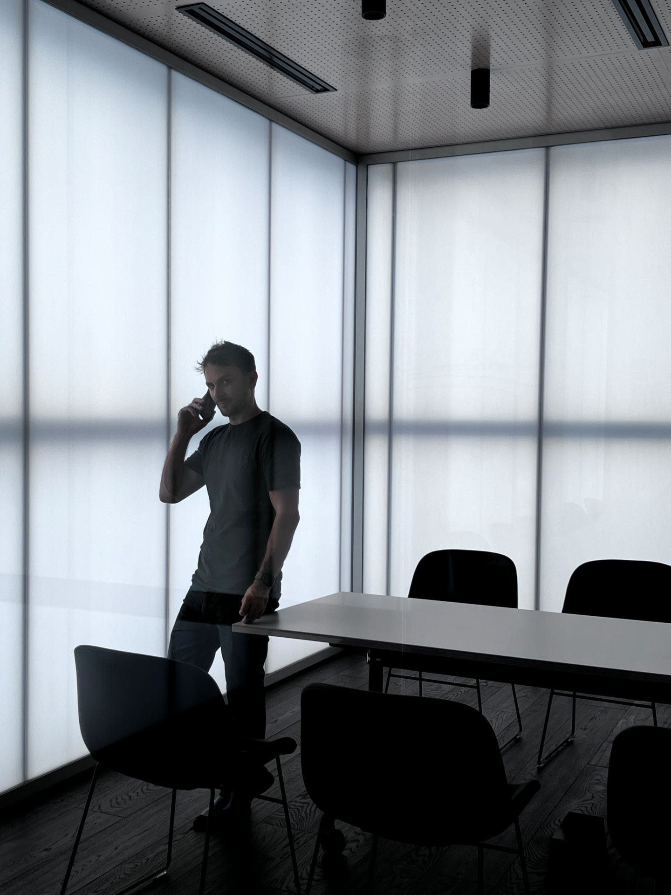
