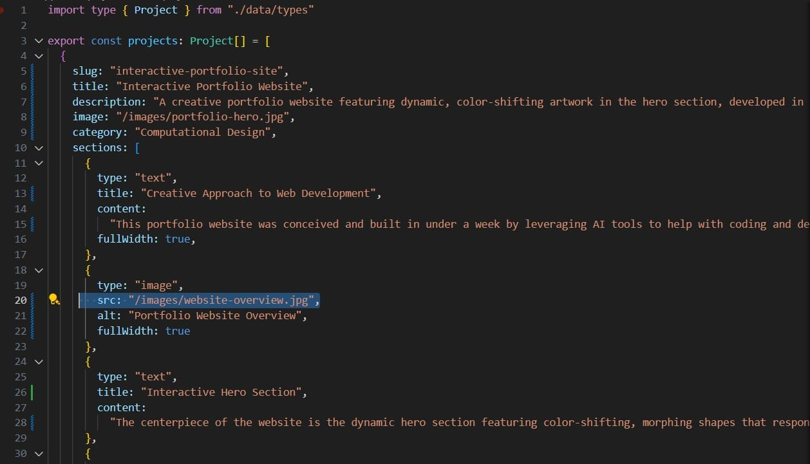
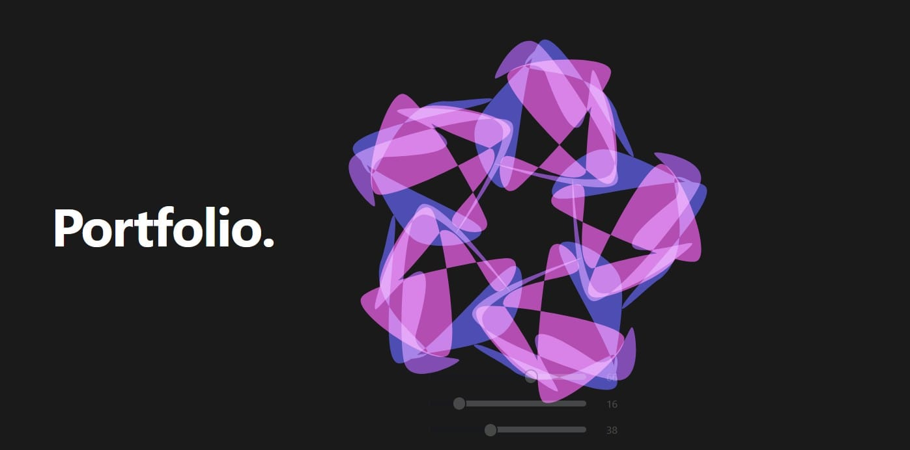
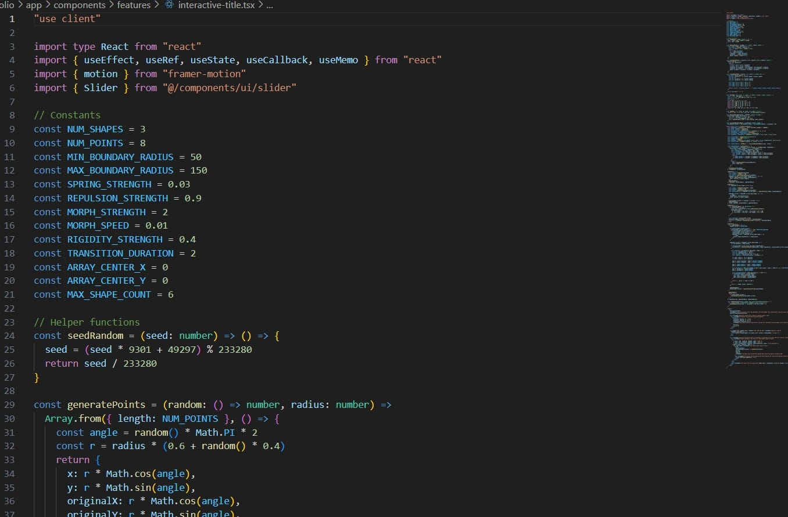
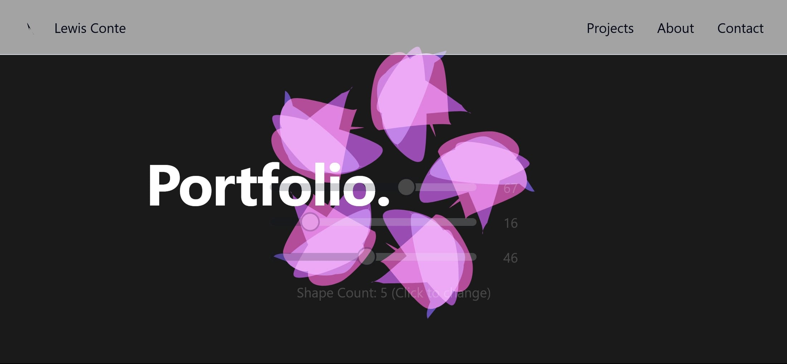

## Creative Approach to Web Development

This portfolio website was conceived and built in under a week by leveraging AI tools to help with coding and design challenges. Though I'm not a full-stack developer, I wanted to create a personalized showcase that would reflect both my architectural design sensibilities and computational interests. I used multiple AI agents to generate much of the code while maintaining creative direction over the project.

## Interactive Hero Section

The centerpiece of the website is the dynamic hero section featuring color-shifting, morphing shapes that respond to user interaction. Inspired by the fluid, organic forms found in nature and the precision of parametric design, I worked with AI tools to translate my creative vision into functioning code that creates an engaging visual experience.

## Collaborative Development

Rather than writing all the code myself, I took a collaborative approach with AI. I described the desired behavior and aesthetic for the interactive elements, then worked with AI tools to generate the necessary React and Framer Motion code. I then adapted and refined this code to achieve the specific visual effects I wanted, learning about web development concepts along the way.

## Design-First Approach

My architectural background informed the visual hierarchy and composition of the site. I focused on creating a coherent user experience that would showcase my work effectively while maintaining visual interest. By combining my design sensibilities with AI-generated code, I was able to create a site that exceeded what I could have built with my coding skills alone.

## Bridging Design and Technology

This project exemplifies my approach to bridging design and technology - using available tools creatively to realize ideas that might otherwise be beyond my technical capabilities. While I didn't write every line of code, I directed the entire process, made critical design decisions, and learned valuable lessons about web development that will inform future projects.

## Learning Outcomes

This project demonstrated the power of combining architectural thinking with AI tools to create digital experiences. The rapid development timeline forced me to focus on the most impactful elements while delegating technical challenges to AI assistance. The result showcases not just my architectural work, but also my ability to adapt and leverage new technologies to bring creative visions to life.
