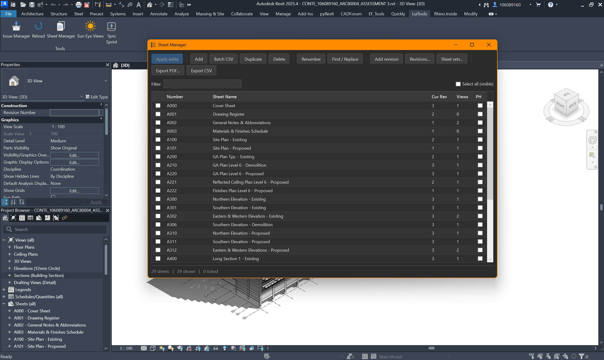
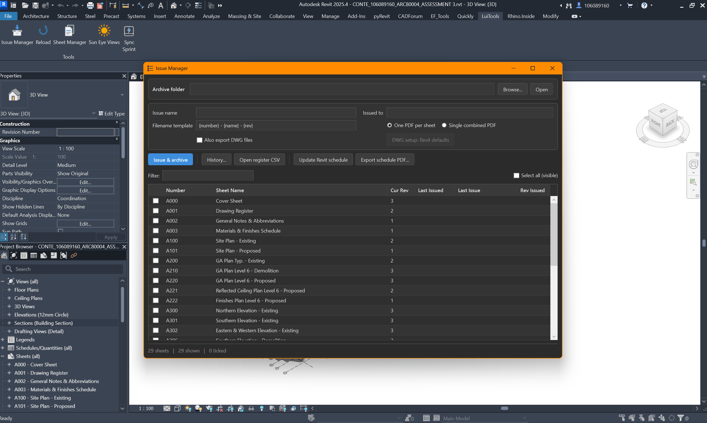
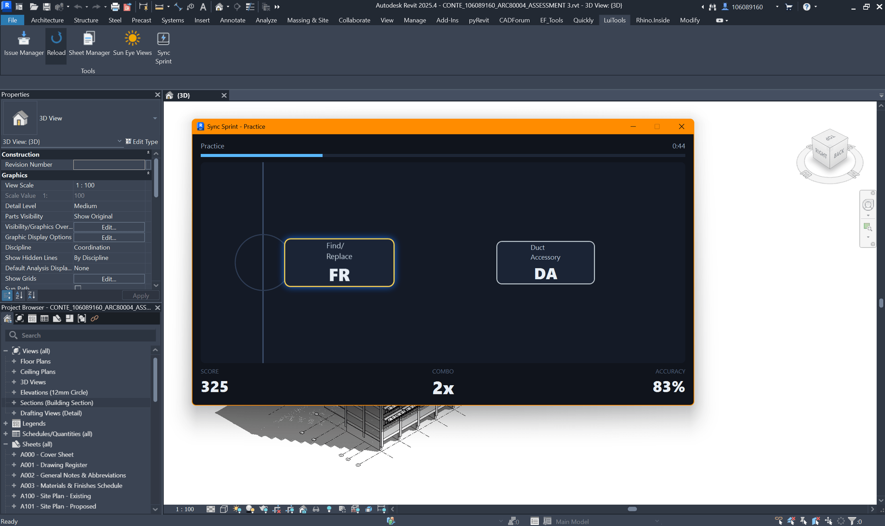

## A Self-Built Revit Toolkit

LuiTools is a pyRevit extension I designed and built to take the friction out of everyday Revit documentation work. Where my earlier H&E Suite tools were quick task-automation scripts, LuiTools is a properly engineered extension: a shared library of theming, data-binding and dialog helpers underpins four polished tools, each presented in a WPF window that follows Revit's own dark and light theme. The goal was to make a handful of tedious, error-prone tasks feel like one coherent, modern product.

## Sheet Manager — Every Sheet as One Editable Grid

Sheet Manager replaces a scatter of native dialogs with a single editable grid of every sheet in the model. You can bulk-renumber with prefixes, suffixes and zero-padding, run find-and-replace across numbers and names, batch-create sheets from a CSV, duplicate or delete in bulk, and manage revisions and sheet sets. Every edit is staged in the grid and written back to the model in a single transaction only when you click Apply — so a 130-sheet renumber is one reviewable action, not 130 clicks. Sheets export to PDF or CSV using a token-based filename template ({number}, {name}, {rev}, {project}, {date}).

## Issue Manager — Issue, Archive, Track

Issue Manager handles the drawing-issue workflow end to end. It exports the selected sheets as PDFs — and optionally matching DWGs — into a dated, per-project archive folder, then appends every issued sheet to a running issue-register CSV. The whole history can be rendered as a sheets-versus-issues matrix, so at a glance you can see which revision of which sheet went out on which issue. It also builds and maintains a native 'Drawing Issue Register' schedule inside the Revit model itself, keeping the register part of the documentation set rather than a spreadsheet on the side.

## Sun Eye Views — Automated Daylight Studies

Sun Eye Views automates a task I used to dread: laying out a daylight study on a sheet. You drag a box on a sheet and the tool generates a grid of camera views, each aligned to the real sun vector computed from the project's location and true-north angle — rows for solar dates (solstices and equinoxes), columns stepping from sunrise to sunset. The views are placed, scaled and labelled automatically, turning an afternoon of manual camera-setting into a single drag.

## Sync Sprint — Turning Sync Dead-Time into Practice

Sync Sprint is the tool I'm most proud of. Synchronising a large Revit model can lock the interface for a minute or more of dead time, so I turned that wait into practice. It's a small rhythm game that drills your real Revit keyboard shortcuts: command names stream toward a hit line and you type the alias before they cross it, with timing-scored points and a combo multiplier. It auto-launches the instant you hit Synchronize with Central and ends when the sync actually finishes. The spawn queue is weighted by spaced repetition toward the shortcuts you personally miss most, tracked across runs — so the more you play, the more it drills your weak spots.

## Engineering Notes

The interesting problem behind Sync Sprint is that Revit blocks its UI thread for the entire duration of a sync. The game therefore runs on its own STA thread with an independent WPF dispatcher and makes zero Revit API calls once launched — the sync hooks communicate with the running game only through process-wide flags that its render loop polls, so nothing ever marshals back onto Revit's frozen thread. The window surfaces without stealing focus and auto-pauses whenever one of Revit's own dialogs needs attention. The rest of the suite is built on a small shared library: a theme module that reads Revit's UI theme and re-skins WPF windows, an INotifyPropertyChanged base class for the editable grid rows, and reusable themed dialogs — the foundation that keeps four separate tools feeling like one product.
