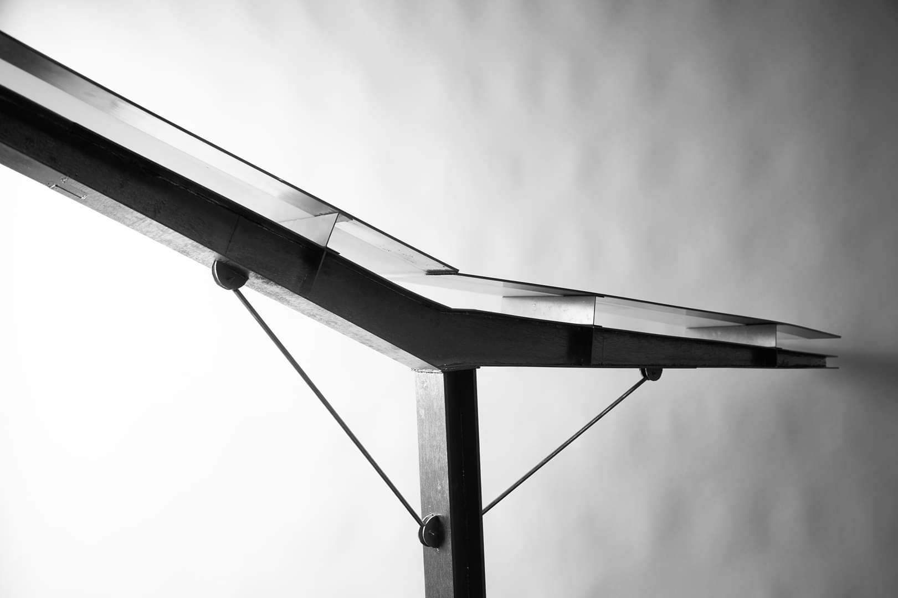
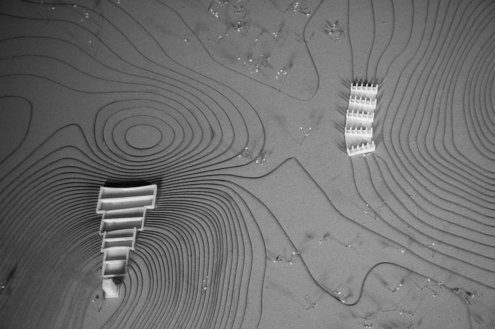
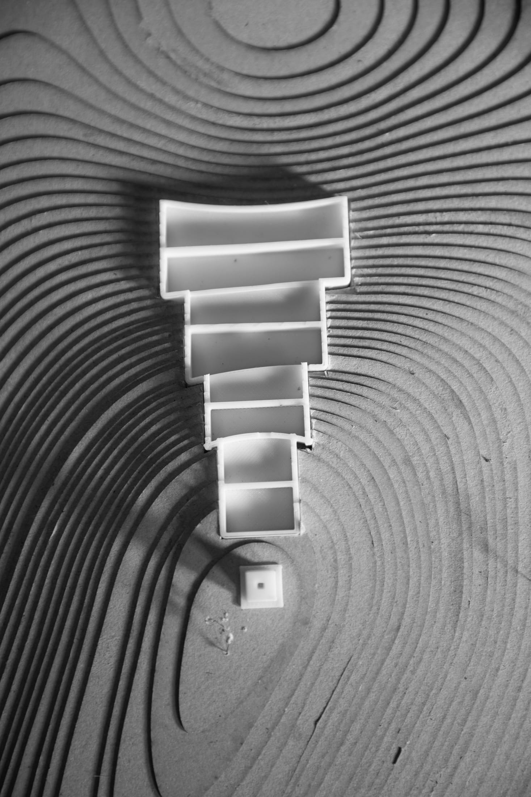
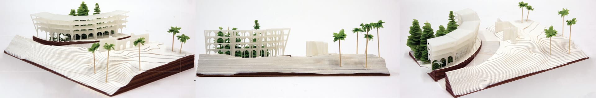

## Collaborative Construction

This large model was a 1:5 mockup of a structural roof element created in a group of 10 people for an assignment. It was a huge challenge pulling this together with so many people. I remember vividly at least 5 wielding spraycans at once getting the steel sheen on the balsa wood. In the end it was too large for the photography studio back drop, but the assignment was a success.

## Academic Exploration

The models on this page were made in my last year of my bachelors degree, both of which I was working with my assignment partner and friend, Harshiv. We liked the way contoured layers looked and wanted to incorporate Ishigami trees in our model, as well as experimenting with 3D printers.

These physical models represent an important aspect of the architectural design process, allowing for the exploration of form, structure, and material in a tangible way. They complement digital design techniques by providing a hands-on understanding of spatial relationships and structural principles.

## Materiality & Craft

The attention to detail in these models demonstrates not only technical skill but also an understanding of how materials interact and how structural elements come together. The experimentation with different materials and techniques reflects a creative approach to model making that extends beyond simple representation to become an exploratory design tool.

