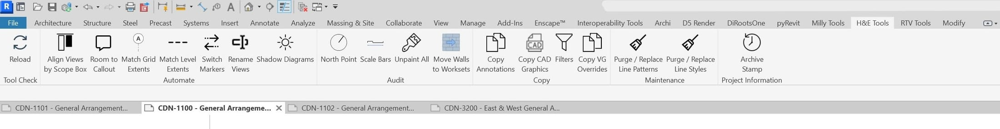
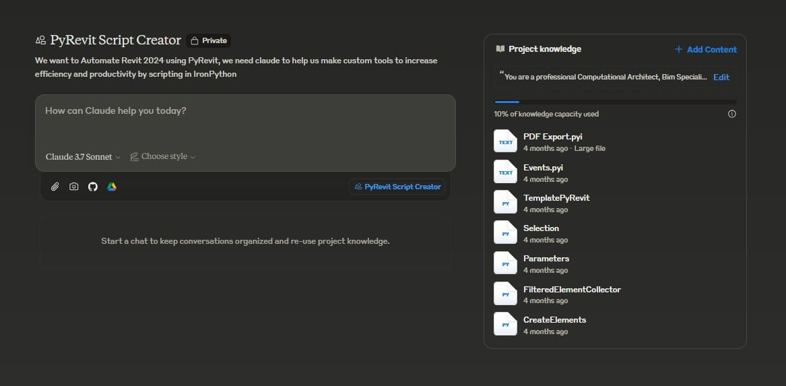
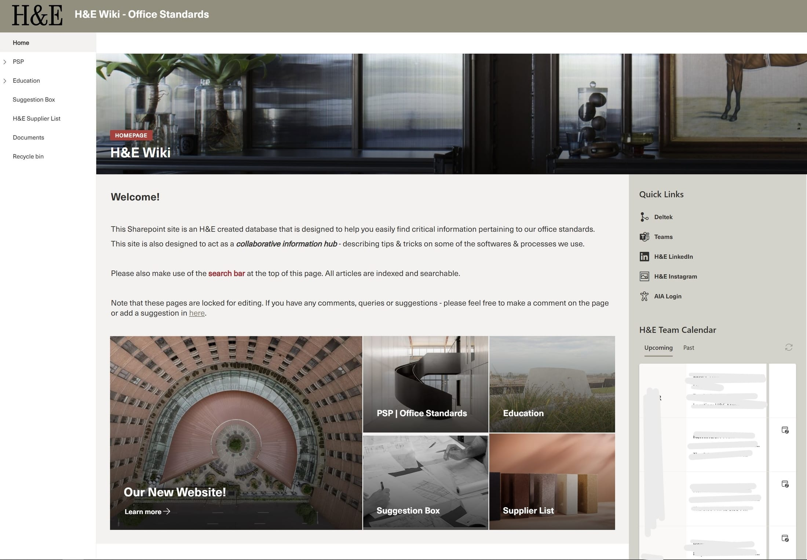
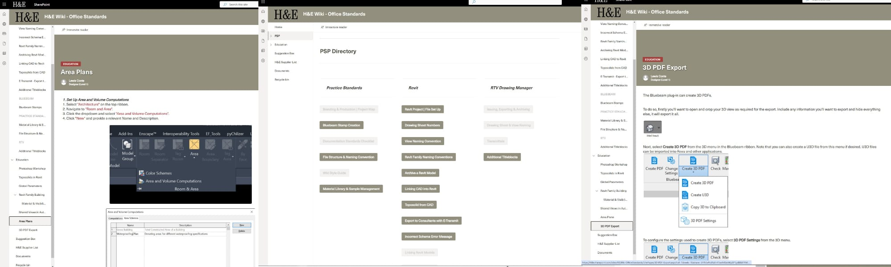

## Technical Innovation

After attending the BILT conference in Melbourne in 2024, our tech team was inspired to address the repetitive inefficiencies in our daily workflows. Many tasks, such as setting north points and scale bars across drawing sets of over 130 sheets, were causing significant fatigue among team members. This led to the creation of the H&E Suite, a collection of custom PyRevit tools designed to automate routine tasks and enhance productivity.

## Learning Through Development

Despite having limited programming experience initially, our team embraced the challenge of creating these tools. We relied heavily on documentation, AI assistance, and collaborative problem-solving. By loading relevant documentation and code into AI tools like Claude, we were able to prototype and generate working code that could be distributed across the office. This process not only produced valuable tools but also expanded our technical capabilities as a team.

## Measurable Impact

The implementation of the H&E Suite had a tangible impact on our workflow efficiency. By automating repetitive tasks, we saved our team valuable time that could be redirected toward design development and problem-solving. The tools also ensured greater consistency across projects and reduced the likelihood of human error in repetitive tasks.

## Knowledge Management Challenge

In parallel with the PyRevit initiative, I identified a critical need for better knowledge management at H&E. With my planned relocation to Melbourne approaching, there was a risk of losing accumulated knowledge. Additionally, the firm struggled with disparate information sources—valuable expertise existed primarily in the directors' minds or was scattered across an archaic file management system.

## Building the Internal Wiki

Using Microsoft SharePoint, I developed a comprehensive internal wiki that served as a centralized repository for institutional knowledge. The wiki featured detailed procedures and processes, tutorials, technical tips, and helpful links to resources. Although there was initial resistance to adoption, the immediate utility of having information readily accessible eventually won over skeptics, leading to widespread adoption across the firm.

## Overcoming Challenges

Both initiatives faced significant challenges. Our limited Python expertise initially slowed development of the PyRevit tools, while organizational resistance and risk aversion to new technologies threatened to derail both projects. Through persistence, demonstration of value, and incremental implementation, we were able to overcome these hurdles and create lasting improvements to the firm's technological infrastructure and knowledge management practices.
