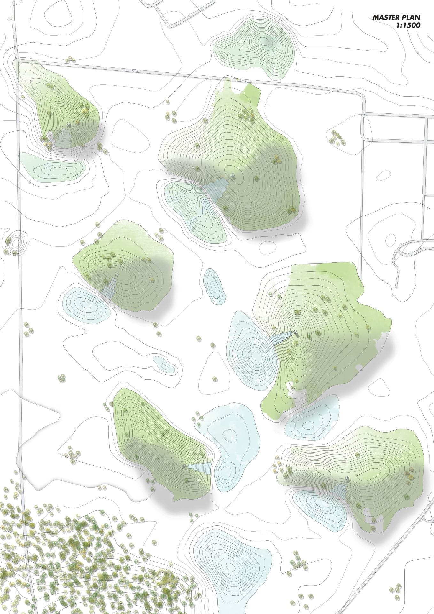
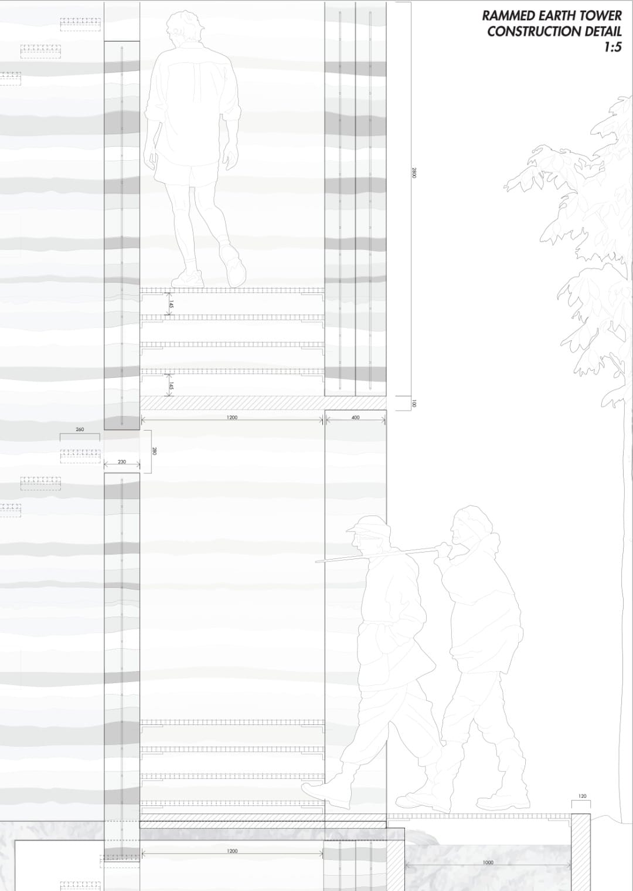
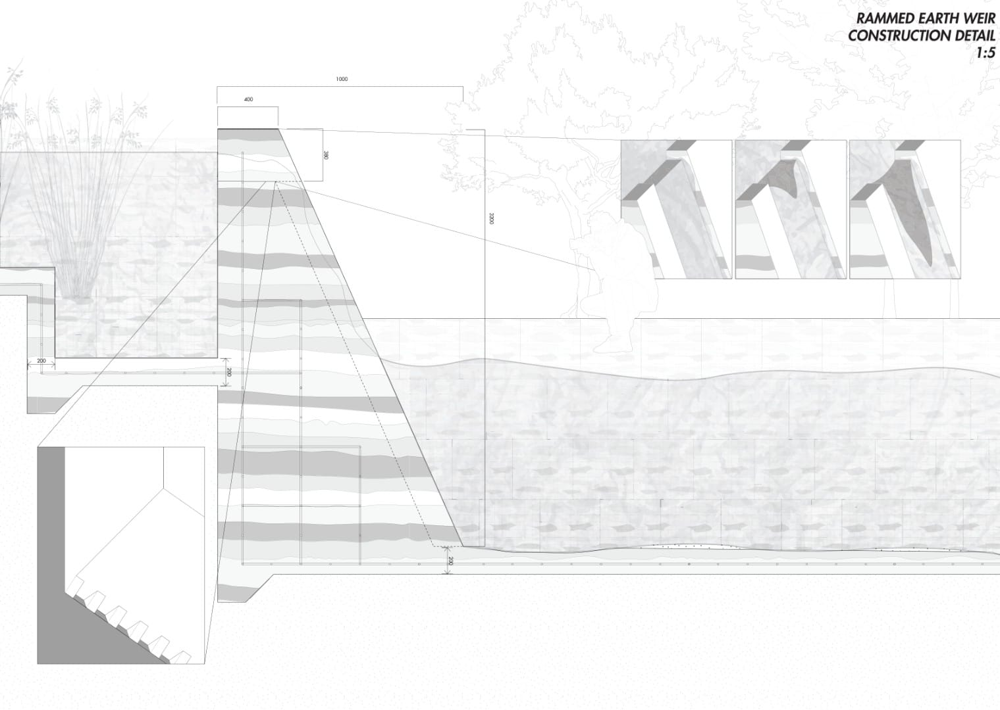
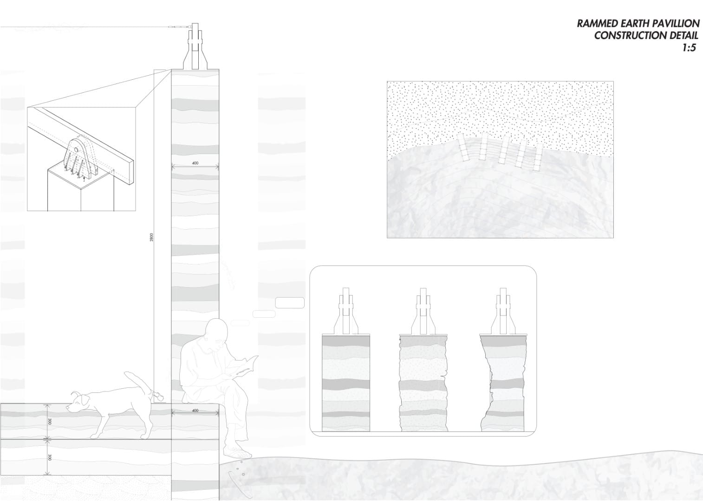
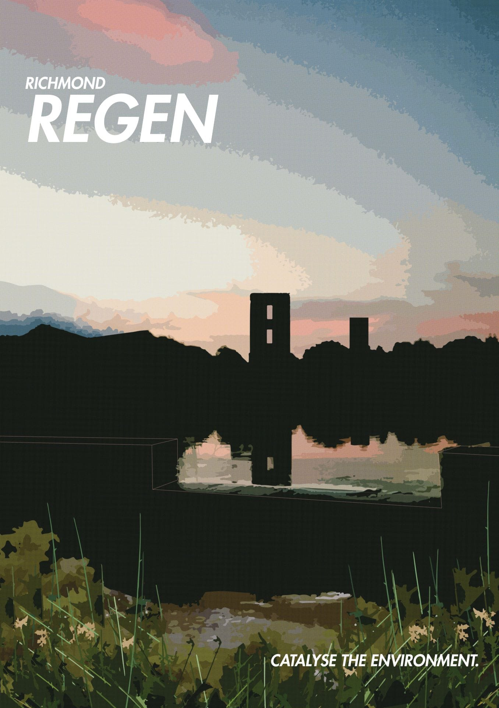

## Conceptual Framework

Richmond Regen was my 5th studio assignment at UTS. The brief challenged us to create 'temples at the periphery of society' - beautiful and interesting infrastructural buildings. Our site was a massive plot of land in Richmond, Western Sydney. It was barren except for a water treatment plant.

## Environmental Vision

We reimagined the water treatment plant as a place that could systematically restore water cleanliness through a series of pump towers and rammed earth weirs. These structures would use gravity and plants to filter the water.The project dotted numerous hills with towers and inbuilt weirs across the landscape, forming the foundation of a larger bush regeneration project. The area is surrounded by new housing developments. Our goal was to capture the toxic runoff from the stormwater systems of the built area, clean it, and return it to the Nepean River.

