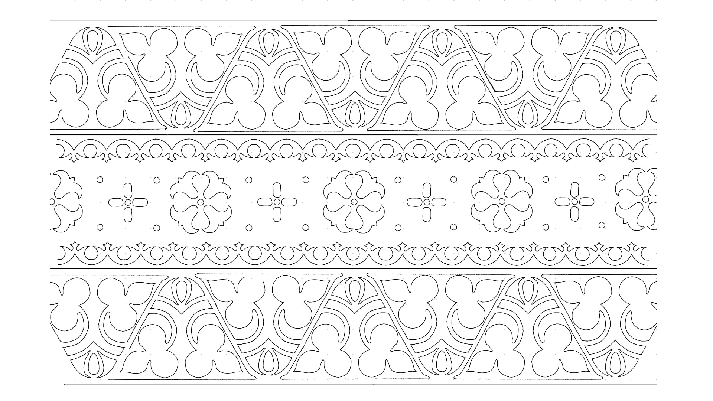
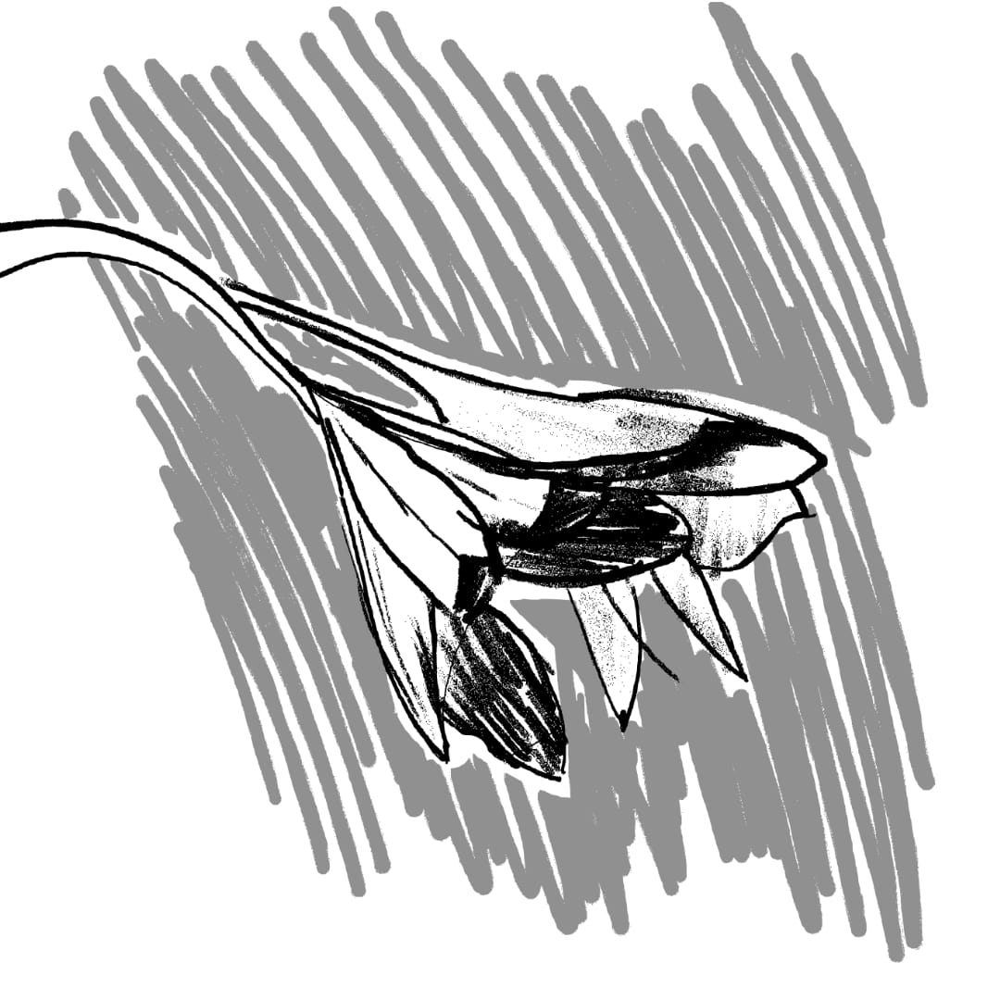

## Drawing Practice

I maintain a sketching practice, finding it both rewarding and helpful in processing the visual world. Most sketches here were created on an e-ink tablet. The botanical and still life sketches are particularly interesting, as they challenge me to capture organic shapes - a departure from the rectilinear nature of architectural drawing.

## Pattern Studies

At the bottom are some pattern studies I have done. I have at this point well over 300 pages of these, too many to show here. So I chose a 3D one, a radial composition and a study of celtic embroidery. These pattern studies connect to my parametric design work, providing inspiration and a foundation for computational explorations.

## Botanical Drawing

Botanical sketching offers me a counterpoint to architectural precision. Through studies of plants and organic forms, I explore the fluid irregularities of nature that contrast with the rectilinear geometries of buildings. These drawings, created primarily on my e-ink tablet, sharpen my observational skills while introducing natural patterns and rhythms into my design vocabulary—enriching my architectural work with organic sensibility.

