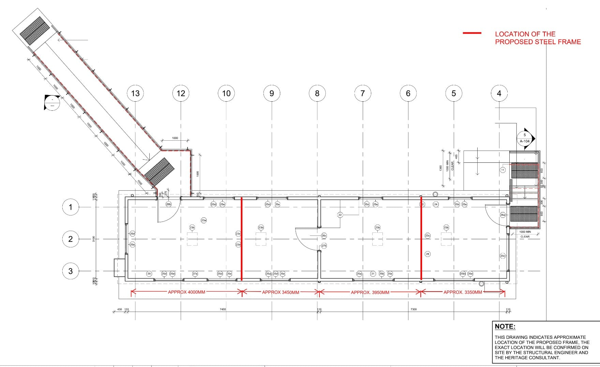
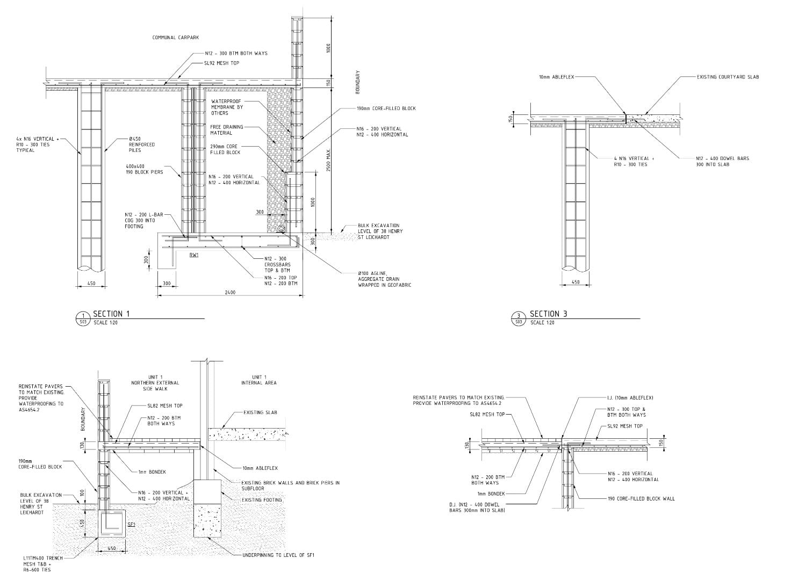
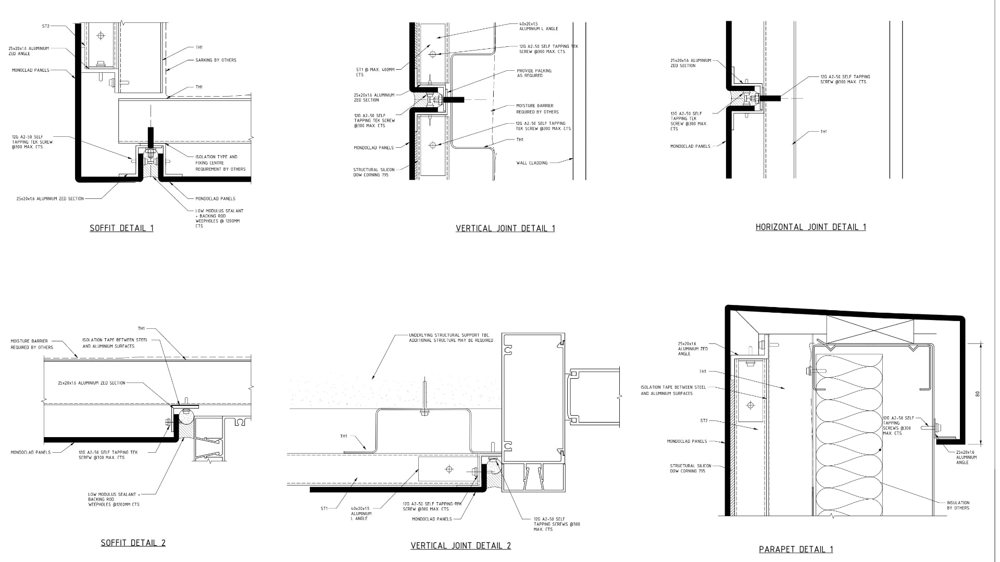

## Professional Drafting

These drawings were completed over the course of my employment at Northrop Consulting Engineers as a draftsperson in the remedial architecture team. They showcase a mixture of sections and detail drawings from a variety of projects. Interestingly, some of these drawings didn't necessarily warrant the level of visual detail I provided. In fact, the Remedial Engineering Lead, Leo, once commented that my drawings were 'too pretty.' This feedback highlights the balance between aesthetic presentation and practical functionality in technical drawings.

## Automation Initiatives

A recurring element in many of these drawings is filled concrete block walls. I drew these so frequently that I eventually automated the section drawings. This was my first venture into task automation in the workplace, an initiative that may have contributed to my selection for the Disruption Lab at Northrop.

## Project Remediate

The drawings presented here include various specifications for retaining walls. Additionally, you'll find waterproofing details for ACP (Aluminum Composite Panel) cladding systems. These were part of Project Remediate, an Australian initiative to replace flammable cladding materials in buildings.

## Technical Precision

This work demonstrates the critical role of precise technical documentation in addressing significant safety concerns in the built environment. The drawings and specifications produced serve as a vital link between design intent and on-site implementation, ensuring that remediation works are carried out to the highest standards of safety and quality.
