## Architectural Challenge

The level 5 mezzanine for the Wentworth Hotel in Sydney's CBD was experiencing severe wind issues. The property had sustained multiple instances of damage where chairs had been blown by the wind into the glass surrounding the courtyard. H&E Architects proposed a range of canopies to protect people in the courtyard from the elements and to potentially extend the bar and restaurant space on Level 5.

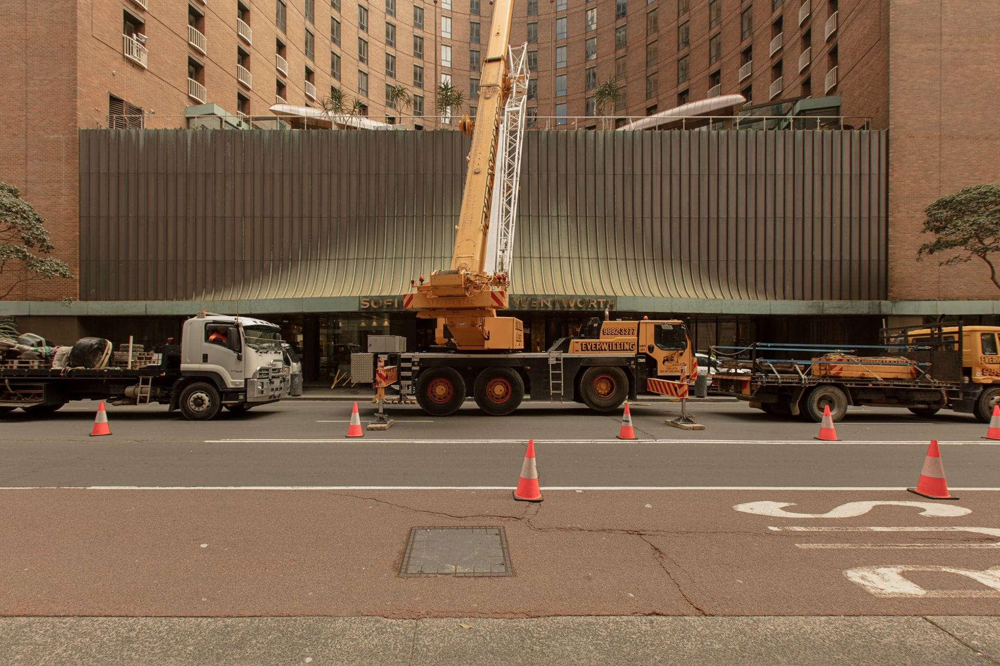

## Design Inspiration

The design draws inspiration from the existing building's copper awning on Phillip St and the bronze-finished fluted columns at its base. The primary design concept bridges the gap from the existing curved profile of the building to a circle at its center. The centerpiece of this renovation is an exquisite copper canopy that serves both aesthetic and functional purposes, incorporating an innovative grid shell structure that pushes the boundaries of architectural design and engineering.

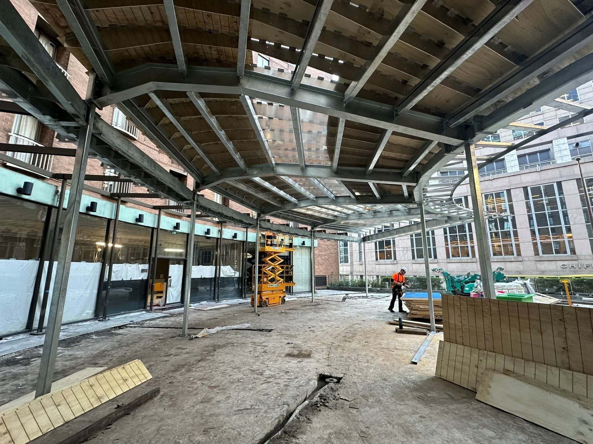

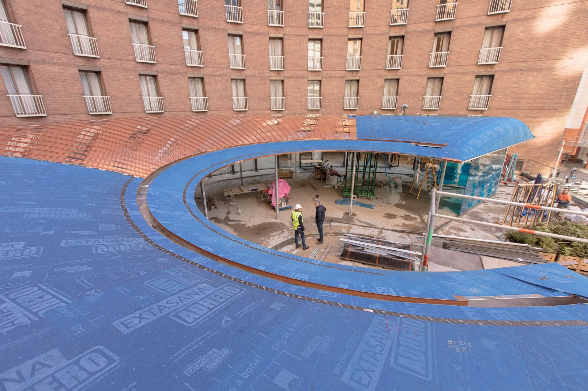

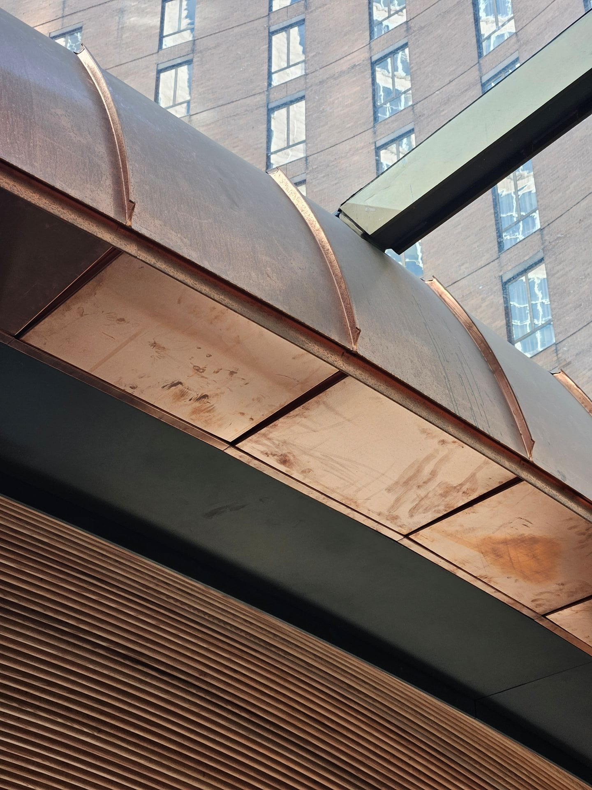

When I joined H&E, the development application for the building had just been accepted. The firm needed someone in Sydney with the skills to create the required geometry to accurately model the canopy shape. This shape is a complex radiating shell structure in which its section not only changes in height and width but also transitions from a truncated dome to an aircraft wing shape at its centre, then back to a truncated dome at a different width.

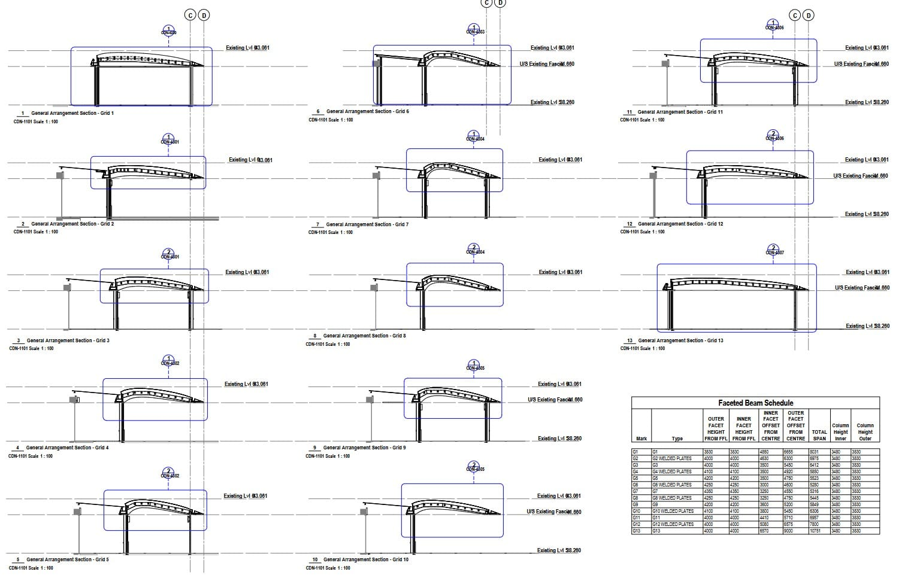

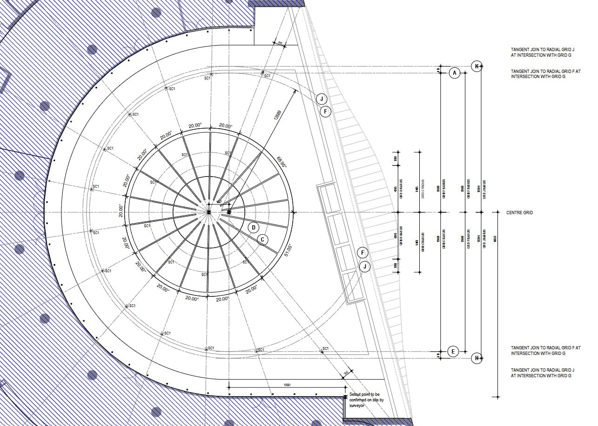

## Technical Innovation

Documenting such a structure was challenging, with grid lines that were simultaneously radial and circular, overlapping and linear. Once this grid system was in place, the structure could be designed. Cantilever Consulting Engineers assisted us here, with the Director Damian Hadley providing an immense source of knowledge that greatly impressed me. The project scope included not only the canopy but also the ground surfaces, which required a tile setout plan to replace the Greek-inspired heritage tiling—a challenge in itself to document.

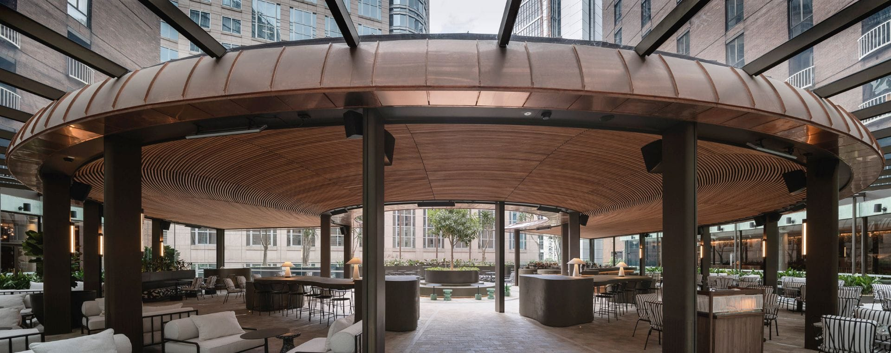

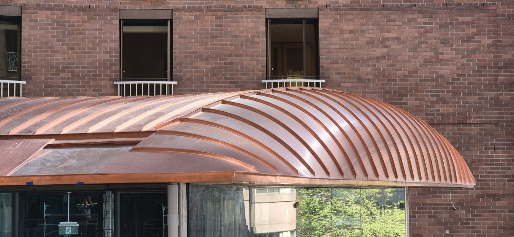

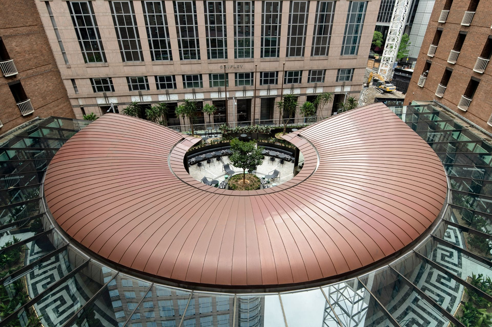

## Computational Approach

I would be remiss if I didn't mention the role of technology in bringing the project together. The final version of the massive Grasshopper script generated a flexible version of the canopy shape and also allowed me to reference the Revit model using Rhino.Inside.Revit. Another challenge for this project lay here, both in convincing the firm that we needed to use this tool to generate the geometry and in learning what was, at the time (and remains), an incomplete and partially implemented workflow. Despite the struggles, this technology allowed for unparalleled flexibility and the possibility for highly agile testing for compliance and clash detection.

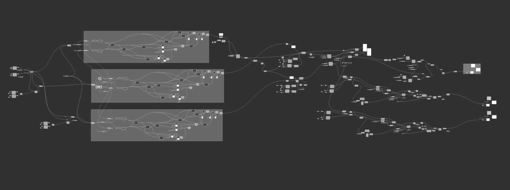

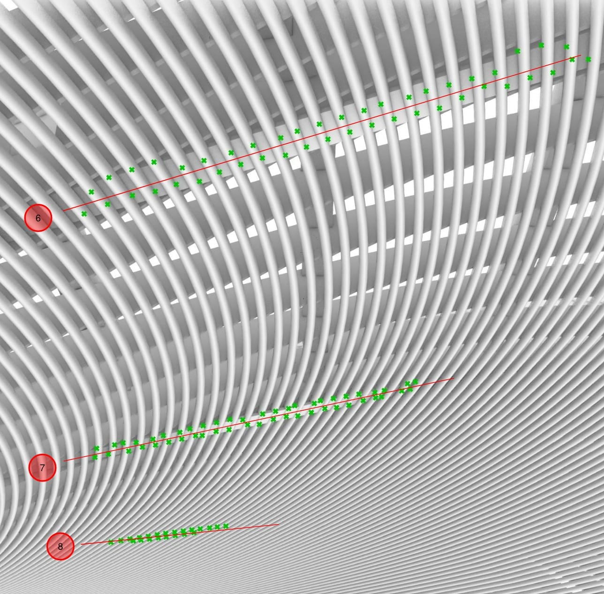

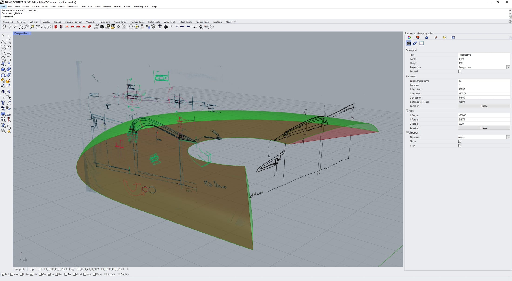
